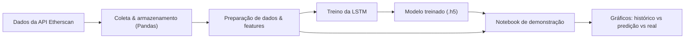

# GasFeesPrediction

Projeto de TCC em Python para:

- **Coletar dados** de gas da rede Ethereum via API Etherscan (v2).
- **Preparar os dados** em formato tabular (Pandas).
- **Treinar uma rede neural recorrente LSTM** para prever taxas de gas.
- **Visualizar** graficamente o histórico, as predições e os valores reais em um período escolhido (via notebooks Jupyter).

> Observação: em trabalhos futuros, este projeto poderá ser integrado a uma
> aplicação web que consome as predições e exibe gráficos interativos.

## Arquitetura e fluxo de funcionamento

### Estrutura de pastas

- `src/api/getGasFeeData.py`: funções para chamar a API Etherscan (v2) para:
  - Preço médio diário do gas (`dailyavggasprice`).
  - Limite médio diário de gas (`dailyavggaslimit`).
  - Total diário de gas usado (`dailygasused`).
  - Estimativa de tempo de confirmação de transações em função do gas price (`gasestimate`).
- `src/data/fetch_gas_data.py`: pipeline de **coleta** e **consolidação** dos dados de gas em CSV.
- `src/features/build_features.py`: preparação de dados e criação de **sequências temporais** para a LSTM.
- `src/models/lstm_model.py`: definição do modelo LSTM e rotinas de treino/salvamento.
- `src/models/train_lstm.py`: script de treino offline da LSTM.
- `notebooks/`:
  - `01_exploracao_dados.ipynb`: exploração inicial dos dados.
  - `02_treinamento_lstm.ipynb`: visão didática do processo de treino.
  - `03_demonstracao_predicao.ipynb`: demonstração visual de predição vs valores reais em um período escolhido.

### Fluxo geral

1. **Coleta de dados**: chamadas à API Etherscan retornam séries diárias de métricas de gas.
2. **Consolidação**: os dados são agrupados em um único CSV indexado por data.
3. **Preparação / features**: limpeza, normalização e criação de janelas temporais.
4. **Treino da LSTM**: a rede aprende a prever o valor futuro de `avgGasPrice_Gwei`.
5. **Demonstração visual**: notebooks carregam o modelo, geram predições e plotam gráficos comparando:
   - Histórico real.
   - Predição da LSTM.
   - Valor real utilizado como referência.

Diagrama conceitual do fluxo:



## Como executar

### 1. Requisitos e instalação

1. Tenha Python 3.9+ instalado.
2. Clone este repositório.
3. Crie e ative um ambiente virtual (recomendado):

```bash
python3 -m venv .venv
source .venv/bin/activate  # Linux/macOS
```

4. Instale as dependências:

```bash
pip install -r requirements.txt
```

### 2. Configuração da API Etherscan

Crie um arquivo `.env` na raiz do projeto com:

```bash
API_KEY=SuaApiKeyEtherscanAqui
BASE_URL=https://api.etherscan.io/v2/api
```

> A API Etherscan possui limites de requisição e alguns endpoints são PRO.
> Consulte a documentação oficial para mais detalhes sobre limites e planos.

### 3. Coleta e consolidação de dados

Use o script `src/data/fetch_gas_data.py` para baixar e consolidar os dados
de gas em um CSV:

```bash
python -m src.data.fetch_gas_data --days 365
```

Isso irá gerar um arquivo semelhante a:

```text
data/raw/gas_data_20240101_20250101.csv
```

Você também pode informar um intervalo explícito:

```bash
python -m src.data.fetch_gas_data --start 2024-01-01 --end 2025-01-01
```

### 4. Treino do modelo LSTM

Com o CSV consolidado, execute o script de treino:

```bash
python -m src.models.train_lstm --data-path data/raw/gas_data_20240101_20250101.csv
```

Ao final, serão gerados:

- `models/lstm_gas_price.h5`: modelo LSTM treinado.
- `models/scaler.pkl`: scaler e configuração das features/sequências.

### 5. Análises e demonstração visual (notebooks)

Registre o kernel do ambiente virtual, se necessário:

```bash
python -m ipykernel install --user --name gasfeesprediction
```

Abra os notebooks no Jupyter Lab/Notebook ou VS Code:

- `notebooks/01_exploracao_dados.ipynb`: exploração descritiva dos dados.
- `notebooks/02_treinamento_lstm.ipynb`: narrativa visual do treino.
- `notebooks/03_demonstracao_predicao.ipynb`: escolha de período e gráficos de:
  - Histórico real de `avgGasPrice_Gwei`.
  - Predições da LSTM.
  - Valores reais usados como referência.

## Transparência do código e do fluxo

Este repositório foi estruturado para facilitar a leitura e explicação no TCC:

- **Módulos separados por responsabilidade** (`api`, `data`, `features`, `models`, `notebooks`).
- **Docstrings** nas funções principais explicando:
  - O que cada função faz.
  - Quais parâmetros recebe.
  - O que retorna.
- **Notebooks narrativos** que contam a “história”:
  - De onde vêm os dados.
  - Como são transformados em sequências.
  - Como o modelo é treinado e avaliado.
  - Como as predições são comparadas com valores reais.

Essas partes podem ser facilmente referenciadas e copiadas para o texto do TCC.

## Trabalhos futuros: integração com aplicação web

Como extensão futura (TODO), este projeto pode ser integrado a uma aplicação web:

- Criar uma API (por exemplo, em FastAPI ou Flask) que:
  - Carrega o modelo treinado e o scaler.
  - Recebe parâmetros de período de análise.
  - Retorna, em JSON, as séries de histórico, predição e valores reais.
- Desenvolver um frontend (por exemplo, em React ou outra tecnologia) que:
  - Consome essa API.
  - Renderiza gráficos interativos semelhantes aos dos notebooks.

No momento, o foco é a **análise de dados e demonstração via notebooks**, que já
atendem aos objetivos do TCC.

