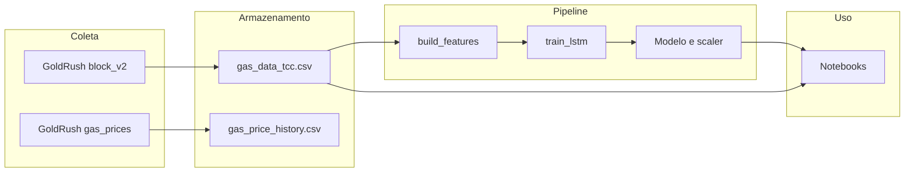

# GasFeesPrediction

Projeto de TCC em Python para:

- **Coletar dados** de gas da rede Ethereum via **API GoldRush (Covalent)**.
- **Preparar os dados** em formato tabular (Pandas).
- **Treinar uma rede LSTM** para prever métricas de gas (ex.: gas usado no próximo bloco).
- **Visualizar** histórico, predições e valores reais em notebooks Jupyter.

Todo o fluxo utiliza apenas a GoldRush API; não há dependência de Etherscan ou outras APIs.

---

## Fluxo de dados



1. **Coleta (blocos)**  
   O script `fetch_blocks_goldrush` chama o endpoint `block_v2` da GoldRush para um range de blocos e gera `data/gas_data_tcc.csv` com: `block_height`, `signed_at`, `gas_used`, `gas_limit`, `base_fee`, `tx_count`.

2. **Coleta (tempo real, opcional)**  
   O coletor `collect_realtime_gas` usa o endpoint de gas prices da GoldRush e anexa leituras em `data/realtime/gas_price_history.csv` (útil para coleta contínua, ex.: Docker).

3. **Preparação**  
   `build_features` carrega o CSV, limpa, normaliza e cria janelas temporais para a LSTM (suporta tanto o schema GoldRush quanto formato legado).

4. **Treino**  
   `train_lstm` treina a LSTM e salva modelo e scaler em `models/`.

5. **Demonstração**  
   Os notebooks carregam o modelo e o dataset para comparar predições com valores reais.

---

## Estrutura do projeto

| Caminho | Descrição |
|--------|-----------|
| `src/api/goldrush_gas.py` | Integração GoldRush: gas prices em tempo real e snapshot atual. |
| `src/data/fetch_blocks_goldrush.py` | Mineração de blocos (block_v2) e geração de `gas_data_tcc.csv`. |
| `src/data/collect_realtime_gas.py` | Coletor contínuo de gas price (GoldRush), append em CSV. |
| `src/features/build_features.py` | Limpeza, escala e sequências temporais para a LSTM. |
| `src/models/lstm_model.py` | Definição e treino da LSTM. |
| `src/models/train_lstm.py` | Script de treino a partir do CSV. |
| `notebooks/01_exploracao_dados.ipynb` | Exploração do dataset. |
| `notebooks/02_treinamento_lstm.ipynb` | Visão do processo de treino. |
| `notebooks/03_demonstracao_predicao.ipynb` | Comparação predição vs real. |

---

## Passo a passo: instalar e rodar

### 1. Requisitos e instalação

- Python 3.9+
- Clone o repositório e use um ambiente virtual (recomendado):

```bash
git clone <repo>
cd GasFeesPrediction
python3 -m venv .venv
source .venv/bin/activate   # Linux/macOS
# ou: .venv\Scripts\activate  # Windows
```

Instale as dependências:

```bash
pip install -r requirements.txt
```

### 2. Configuração da API GoldRush

Crie um arquivo `.env` na raiz do projeto:

```bash
# Obrigatório
GOLDRUSH_API_KEY=sua_chave_covalent_aqui

# Opcionais (valores padrão abaixo)
GOLDRUSH_BASE_URL=https://api.covalenthq.com
GOLDRUSH_CHAIN_NAME=eth-mainnet
GOLDRUSH_EVENT_TYPE=erc20
GOLDRUSH_QUOTE_CURRENCY=USD
```

Obtenha uma chave em [Covalent/GoldRush](https://www.covalenthq.com/).

### 3. Coleta de dados (retroativa)

O projeto obtém dados **retroativos** (históricos) via GoldRush: você escolhe um intervalo no passado e o script baixa os blocos nesse intervalo.

**Por blocos** (número do bloco inicial e final):

```bash
python -m src.data.fetch_blocks_goldrush 18900000 18900100 -o data/gas_data_tcc.csv
```

**Por data** (intervalo de datas; o script converte em blocos automaticamente):

```bash
python -m src.data.fetch_blocks_goldrush --start-date 2024-01-01 --end-date 2024-01-07 -o data/gas_data_tcc.csv
```

Saída padrão: `data/gas_data_tcc.csv`. Opções úteis:
 
- `--tx-count` para incluir número de transações por bloco (mais requisições)  
- `-o caminho/arquivo.csv` para outro caminho  

Para treino com mais dados, use um range maior (ex.: mais dias ou milhares de blocos). O script faz pausas entre requisições para evitar rate limit.

### 4. Treino do modelo LSTM

Com o CSV gerado:

```bash
python -m src.models.train_lstm --data-path data/gas_data_tcc.csv
```

Serão gerados:

- `models/lstm_gas_price.h5` — modelo treinado  
- `models/scaler.pkl` — scaler e configuração de features/sequências  

Você pode passar `--model-dir` e `--scaler-path` para outros caminhos.

### 5. Notebooks (exploração e demonstração)

Registre o kernel do ambiente (se necessário):

```bash
python -m ipykernel install --user --name gasfeesprediction
```

Abra no Jupyter Lab/Notebook ou VS Code:

- **01_exploracao_dados.ipynb** — análise do dataset GoldRush (`gas_data_tcc.csv`).  
- **02_treinamento_lstm.ipynb** — narrativa do treino.  
- **03_demonstracao_predicao.ipynb** — período escolhido, gráficos de predição vs real.  

Nos notebooks, use o caminho do CSV (ex.: `data/gas_data_tcc.csv`) onde for pedido o dataset.

### 6. Coleta contínua com Docker

Para montar um histórico próprio em tempo real com GoldRush:

1. No `.env`, configure pelo menos:

```bash
GOLDRUSH_API_KEY=sua_chave
```

2. Suba o coletor:

```bash
docker compose up -d --build
```

O serviço `gas-collector` chama a GoldRush periodicamente e anexa linhas em `./data/realtime/gas_price_history.csv` (ou o path definido em `DATA_PATH`).

---

## Transparência e TCC

- Módulos separados por responsabilidade (`api`, `data`, `features`, `models`, `notebooks`).  
- Docstrings nas funções principais (objetivo, parâmetros, retorno).  
- Notebooks narrativos: origem dos dados (GoldRush), transformações, treino e comparação predição/real.  

---

## Trabalhos futuros

- Integração com aplicação web: API (ex.: FastAPI) que carrega o modelo e retorna histórico/predições em JSON; frontend com gráficos interativos.
